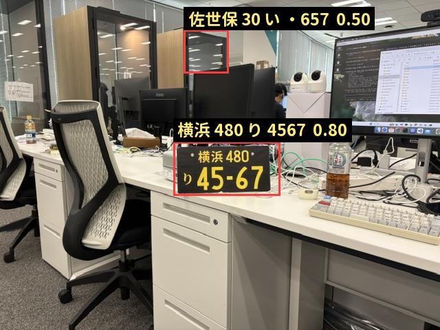
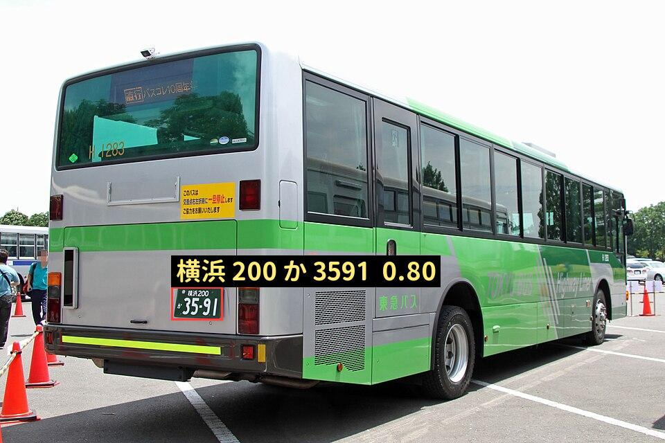

# yolo_lpr_cpp — 日本のナンバープレート認識を C++ で（検出 YOLOv8 → 4隅補正 → 位置別クラス分類）

日本の車両ナンバープレートを **検出して読む** システム。モデルは全段 **ONNX**、推論は
**依存ライブラリなしの C++**（MSVC / mingw / Emscripten）で、ブラウザ (WASM) デモまで含む。
学習は Colab / Kaggle の無料枠で回せる範囲に収める（既存重みからのファインチューニング＋合成データ）。

**設計の核: Python と C++ が対等。** データ生成・学習・推論・評価・ONNX 入出力のすべてを
**両言語で実装し、同じ CLI・同じラベル定義・同じ数値**が出ることをテストで縛る。
どちらか一方しかできない機能は作らない（詳細は下の「Python と C++ の対等性」）。

姉妹リポジトリ: 検出エンジン [yolov8_cpp](https://github.com/yomei-o/yolov8_cpp) ／
9-head 分類器 [lpr_cpp](https://github.com/yomei-o/lpr_cpp) ／ [yolox_cpp](https://github.com/yomei-o/yolox_cpp)。
本リポジトリはこの2つを**製品として使える1本のパイプライン**にまとめ直すもの。

## ▶ ブラウザで試す（送信なし・完全ローカル）

**https://yomei-o.github.io/yolo_lpr_cpp/wasm/**

カメラか画像ファイルを渡すと、その場で読みます。**「自動スキャン」を押すとカメラを見続け、プレートが
現れたら自動で検出して読みます**（追跡しながらフレーム方向に確率を足し込むので、見続けるほど安定して
確定します。0.6 秒/フレーム、推論は Web Worker）。**認識器は自前で学習したモデル**
（`models/plate_ocr_v2.onnx`、実データ hold-out の地域名 **97.9%**）。検出器はページ上で切り替えられます:

| 検出器 | 得意 | 苦手 |
|---|---|---|
| PlateYOLO-JP 320（借り物・AGPL） | 車ごと写った小さいプレート（画面幅 5–12%） | **20% で 0.07、30% 超は検出ゼロ** |
| **自前 yolov8n 320**（合成データのみ・学習中） | **プレート単体・近接（12–95% で 0.66–0.90）** | 遠景（5% で 0.09） |

**実写の黒ナンバー（車体なし・机の上）で測った結果**（`assets/kei-commercial-yokohama480ri4567.jpg`）:

| プレートが画面幅に占める割合 | 5% | 8% | 12% | 20% | 30% | 45% | 60% | 80% | 95% |
|---|---|---|---|---|---|---|---|---|---|
| 借り物 PlateYOLO-JP | 0.76 | 0.83 | 0.70 | 0.07 | なし | なし | なし | なし | なし |
| **自前 yolov8n（合成のみ）** | 0.09 | 0.42 | **0.66** | **0.83** | 0.85 | 0.85 | 0.86 | 0.89 | **0.90** |

元画像そのまま（プレートが画面幅の 24%）では、**借り物は検出ゼロ・自前は det 0.80 で検出して
「横浜 480 り 4567」と正しく読めた**。2 つは相補的なので、ページ上で切り替えられるようにしてある。
（自前を遠景にも強くするのが M7 の残り。合成の背景を車体にする／実プレートを貼るなどで詰める。）

近接で撮ると検出器が外すので、その場合は「**枠を手で指定**」でドラッグしてください（認識器は近接でも読めます）。

**現在の状態: ワンパス推論が CLI と WASM で動く。認識器は学習済み、検出器は学習中。**
進捗と残作業は [RESUME.md](RESUME.md)。

## 動かす

```sh
sh build/gcc.sh pure/jlpr.cpp -o jlpr.exe          # または sh build/cc.sh (MSVC, vcvars 不要)

./jlpr.exe detect --img assets/tokyu-bus-yokohama200ka3591.jpg \
                  --det models/plate_det_yolox.onnx --ocr models/plate_ocr.onnx --out out.png
#   plates: 2 (conf>=0.15, 6 raw detections over all classes)
#     [0] box (250,407)-(337,465) det 0.82  crops 6
#          横浜 200 か 3591
#          conf 0.57 1.00 1.00 1.00 1.00 1.00 1.00 1.00 1.00

python tools/jlpr.py detect --img assets/tokyu-bus-yokohama200ka3591.jpg   # Python 版（同じフラグ）
python tools/parity/labels.py                       # ラベル表の C++⇔Python 一致 (M1)
python tools/parity/infer.py --ref <lpr_cpp>/pure/ref   # 推論の C++⇔Python 一致 (M3)
./jlpr.exe parity-ocr --ocr models/plate_ocr.onnx --ref <lpr_cpp>/pure/ref
#   exported ONNX vs original-ONNX fixture: worst 3.299e-05   argmax 9/9   MATCH
```

ブラウザ（WASM、送信なし・完全ローカル）:

```sh
sh build/emcc.sh wasm/jlpr_wasm.cpp -o wasm/jlpr.js
python -m http.server 8000     # リポジトリのルートから → http://localhost:8000/wasm/
node wasm/test_node.js         # ヘッドレスの回帰テスト（CLI と同じ画素で同じ文字列を assert）
```

実測（実写 960×640、CPU 1 スレッド）: CLI **2.2 秒** / WASM(node, SIMD) **1.9 秒** で
`横浜 200 か 3591`（地域名の信頼度 0.96）。内訳は検出 320px と 6 クロップ分の認識。

**まだ暫定なところ**: 検出器は [PlateYOLO-JP](https://github.com/Kazuhito00/PlateYOLO-JP-Prototype)
（YOLO12・AGPL-3.0）の NMS を剥がしたものを借りている（`tools/strip_nms.py`）。自前 yolov8n nc=1 に
差し替えるのは M7 で、**それが超えるべき基準がこの暫定検出器**。4隅補正（M6）も未実装。

参考までに、検出器を替えただけで認識側が受ける影響（同じ写真・同じ認識器）:

| 検出器 | 誤検出 | 地域名 conf | CLI 時間 |
|---|---|---|---|
| YOLOX-tiny 416（`lpr_cpp` 由来・最初の暫定） | 1 件 (det 0.24) | **0.57** | 5.6 秒 |
| PlateYOLO-JP 320（NMS 剥がし・現行） | 0 件 | **0.92** | 2.4 秒 |

box が良くなるだけで地域名の信頼度が 0.57 → 0.92 に動く。**入力の正規化が精度を支配している**という
仮説の裏付けで、4隅補正（M6）を入れる理由がそのまま数字で出ている。

## いま出せている数字（2026-08-19）

| | 数字 | どう測ったか |
|---|---|---|
| 認識器（地域名） | **97.9%** | 実データ 144 枚 hold-out、margin 0.03 固定、TTA なし（`jlpr val --holdout`） |
| 認識器（合成データの数字系 head） | 87-90% | 合成 200 枚（地域名は実データ専任なので合成では 12%） |
| 4隅補正 | 近接で地域名 0.42 → **0.85** | 実写の黒ナンバー。90px 未満の box では使わない（実測で悪化するため） |
| 自前検出器（近接・車体なし） | **0.66-0.90**（画面幅 12-95%） | 実写の黒ナンバーで切り出し窓を振って測定 |
| 借り物検出器（遠景・車ごと） | 0.70-0.83（5-12%）、20% で 0.07 | 同上 |
| トラッキング | 0.56-0.61 秒/フレーム、3 フレームで確定 | 実写 640×480、node/SIMD |
| C++ ⇔ Python | 推論は文字列・argmax 一致、学習は step1 の loss 差 1e-6 | `tools/parity/*.py` |

## 実写での検出結果

どちらも手元で撮った実写 1 枚をそのまま入れた結果（`tools/infer.py --out` が描いた画像）。
枠が検出、上のラベルが読んだ内容、`det` が検出スコア、`地域名` の後ろが地域名 head の確信度。

### 軽自動車の事業用（黒ナンバー）を近接で — 車体はフレームに無い



`横浜 480 り 4567` を正解。**プレート単体でも検出できる**のがこのモデルを自分で学習した理由で、
借り物の検出器（PlateYOLO-JP）はこの写真では 1 個も検出できない（0 detections）。
右下にもう 1 つ 0.50 の枠が出ているのは誤検出（モニタの縁）で、業務用に閾値を上げるならここが基準になる。

### バスのプレートを遠景で — 借り物検出器が強い領域



`横浜 200 か 3591` を正解。画面幅の 11% しかない小さなプレートで、
この領域は借り物検出器も得意（両者は補完関係にあり、デモでは切り替えられる）。

## パイプライン（3段）

```
入力画像
  │
  ├─[1] 検出   yolov8n  nc=1 (plate)   640×640   → box
  │        （小さいプレート用に COCO yolov8n で車を切ってから再検出する2パスを任意で）
  ├─[2] 矯正   corner-net 64×64 → 4隅 8座標      → 透視変換で 128×128 に正規化
  └─[3] 認識   dwsep-ResNet 128ch 128×128        → 11 head の argmax
                                                    → 「品川 371 ら 100」＋ 種別/信頼度
```

**なぜ 2段目を足すのか。** `lpr_cpp` の実測で、地域名 head（133クラス）は**クロップ余白 数%で
奄美 / 横浜 / 練馬 が入れ替わる**。同リポは 6クロップの TTA（確率和）で緩和しているが、これは
入力正規化がブレていることの症状であって原因治療ではない。4隅を推定して射影補正し**固定マージンで
128×128 を作る**のが正攻法で、合成データなら4隅の正解がタダで得られる。ここが「少データで高性能」の要。

## 確定した方針（2026-08-19）

| 論点 | 決定 | 理由 |
|---|---|---|
| 学習の実装 | **Python と C++ の両方で対等に**（成果物・数値ともに一致させる） | ここが本リポの主眼。無料枠での長時間学習は速い方（Python/CUDA）で回してよいが、C++ 単独でも同じ学習・同じ ONNX 出力ができる状態を維持する |
| モデル配布形式 | **ONNX（全3段）** | C++ / WASM 双方が同じファイルを直読み。姉妹リポの ONNX リーダを流用 |
| 対応範囲 | 中型(330×165)・**大型(440×220)**・軽、白/黄/緑/黒、**地方版図柄入り** | 種別は3段目の head として明示的に出す。二輪・2段組みは初版対象外 |
| 矯正段 | **入れる**（4隅回帰 → 透視変換） | 上記のとおり地域名 head の余白依存を根本から潰す |
| 事前学習重み | **AGPL 許容**（Ultralytics `yolov8n.pt` から転移） | 少データ前提で検出精度が最優先。姉妹リポと同じ扱い |
| 推論の依存 | なし（自前 ONNX ランナ＋stb） | MSVC / mingw / emcc の3系統で同一ソース。`-DUSE_EIGEN` で CPU 高速化 |

## Python と C++ の対等性

両言語に同じ機能を持たせ、**同じサブコマンド名**で叩けるようにする。片方だけの近道は作らない。

| 機能 | Python (`tools/`) | C++ (`pure/`) | パリティの条件 |
|---|---|---|---|
| ラベル表（地名138/かな/分類番号/種別） | `labels.py` ✅ | `spec.hpp` ✅ | 唯一の定義 `spec/labels.txt` を**両方が実行時にパース**（生成物ではなく同じ入力）。dump と埋め込みヘッダがバイト一致 |
| 合成データ生成 | `gen.py` | `gen.cpp` | 同じ seed で**文字列・4隅・変換パラメータ・色・種別が完全一致**。画像はラスタライザ差（PIL/FreeType vs stb_truetype）が出るので、一致は幾何とラベルまでとし、画像は統計と目視で同等を確認 |
| 学習（認識器） | `train_ocr.py`（PyTorch 移植、ONNX 重み読み込み） ✅ | `jlpr train`（**ONNX グラフを直接学習**） ✅ | 同じ ONNX・同じ seed・同じ batch で **step1 の loss 差 1e-6**、以降は相対 1% 以内（実測、`tools/parity/train.py`） |
| 学習（検出器） | `train_det.py`（Ultralytics） ✅ | yolov8_cpp の v8 loss / TAL 移植が必要（M7b） | 同上の方式で比較する予定 |
| 学習（4隅） | M6 | M6 | — |
| 推論 | `infer.py`（onnxruntime） ✅ | 自前 ONNX ランナ ✅ | 同一画像で**同一文字列・同一 argmax**、box 差 0.10px / det 差 0.0000（実測）。自作側の float 加算誤差は認識器 3.3e-05・検出器 3e-03 なので、閾値ぎりぎりの box は割れる |
| 評価（mAP / 全文一致 / 色別内訳） | `eval.py` | `jlpr val` | 同じデータセットで**同じ数値**（mAP は 1e-3 以内） |
| ONNX 出力 | `torch.onnx.export` | 自前エクスポータ | 出力 ONNX を相互に読み込んで **forward が 1e-5 以内** |
| WASM | — | `emcc`（C++ 側の役目） | ブラウザで CLI と同じ文字列が出る |

**Python は必須ではなく、速いだけ。** 時間に余裕があるなら **C++ だけで全部完結できる**
（合成データ生成 → 学習 → ONNX 出力 → 推論 → WASM デモ）。逆に急ぐなら本番学習だけ Python/CUDA に投げる。
どちらの経路でも同じ ONNX が出て、同じ数値が出る。

**速度は対等ではない**（そこは割り切る）。姉妹リポの実測で C++/CUDA 経路は COCO128/640/batch4 で
約 4.6 分/epoch = 100 epoch なら約 8 時間、CPU なら 640px で丸一日規模。無料枠で本番学習を回すときは
Python/CUDA が現実的で、C++ 側は**同じ結果に到達できることを小規模で証明し、追加学習にも使える**状態を保つ。

## モデル仕様

### [1] 検出器 — yolov8n / nc=1
- 入力 640×640 letterbox（WASM 用に 416 / 512 も出す）、出力は素の YOLOv8 head（DFL 16bin）
- ONNX は **NMS 前**まで。decode + NMS は C++ 側（`yolov8_cpp/pure/infer.hpp` 由来、nc 任意に一般化）
- 学習は `yolov8n.pt` から転移。mosaic / mixup / HSV / affine ＋ プレート色の均衡と夜間・逆光・ブラー
- 評価は mAP@0.5 と**プレート色別 recall を別掲**（下の「既知の落とし穴」参照）

### [2] 4隅回帰器 — corner-net（新規・小型）
- 入力: 検出 box を 1.25 倍に広げた crop を 64×64
- 出力: 4隅の (x,y) × 4 = 8 値（crop 正規化座標）。損失は Wing / smooth-L1
- 学習: 合成データが主（4隅は生成時に既知）。実データは正面向きを弱ラベルとして併用
- 想定サイズ 0.2–0.5 MB。ここで得た4隅で 128×128 に warp（マージンは実験で決めて記録する）

### 学習の実測（M5、2026-08-19）

出発点は出荷済みの重み（`models/plate_ocr.onnx`）。実データ 720 枚を 576 train / 144 hold-out に
分けて（両言語で同じ分割）、合成データと混ぜて 600 step 学習した結果:

| | 実データ hold-out region top1 |
|---|---|
| 出荷済みの重み | 91.7% |
| **600 step 学習後（`plate_ocr_v2.onnx`）** | **95.1%** |

学習前に見つけて直したこと（数字が出たので分かった）:
- **region を 133→138 に広げるとき、新クラスの bias が 0 だと既存クラスに勝ってしまう**
  （logit 0 は負の logit に勝つ）。学習前から 91.7% → 85.4% に落ちていた。bias を −10 で初期化して解決。
- **合成データで region head を学習させると実データ精度が落ちる**（78% → 67%）。合成サンプルは region をマスク。
- **BN 統計を凍結**し、backbone は lr×0.1。合成が多いバッチで BN 統計が動くと実データ精度が下がる。

### [3] 認識器 — depthwise-separable ResNet 128ch（`lpr_cpp` の構造を継承）
既存 ONNX（実データ学習済み）の重みを初期値にする。構造は `lpr_cpp/pure/ref/ARCH.md` の通り:
stem `Conv4×4/s4` → **Conv→ReLU→BN**（BN eps 1e-3）で分岐A(6ブロック)・分岐B(5ブロック) →
GAP → Dense+softmax。head を 9 → **11** に拡張する:

| head | クラス数 | 備考 |
|---|---|---|
| region（地域名） | **138+** | 既存 133 に **十勝・日光・江戸川・安曇野・南信州**（2025-05 追加）を足す。現行リストを確定して固定する |
| class_num_01 / 02 / 03（分類番号） | 10 / 20 / 22 | 既存踏襲（2桁目以降にアルファベット、3桁目に空白あり） |
| hiragana | 53 | 既存踏襲（`あ〜ろ` ＋ `ABCEHKLMTYV`）。お・し・へ・ん は実在しないので生成時に除外 |
| plate_num_01..04（一連番号） | 11 / 11 / 11 / 10 | 値 10 = 空白（`・` 表示側） |
| **plate_kind**（新規） | 8 | 自家用普通 / 事業用普通 / 軽自家用 / 軽事業用 / 大型 / 図柄入り / その他 / 不明 |
| **legible**（新規） | 2 | 読めるか否か。運用時の棄却閾値に使う |

head 追加は分岐の GAP 出力に Dense を足すだけなので、既存 backbone の初期値をそのまま活かせる。

## データ戦略（実データは少なく、生成で埋める）

### 集める（実データ）
| 出所 | 内容 | ライセンス | 用途 |
|---|---|---|---|
| [dyama/alpr_jp](https://github.com/dyama/alpr_jp) | プレート crop 1,249枚（うち **720枚が `自家用/<地名>/` 構造＝地域名ラベル付き**, 66地名）＋ ネガ 4,420枚 | MIT（撮影者に著作権） | 認識器の実データ微調整・地域名 head の検証・検出のハードネガ |
| [Number Plate in Japan (Roboflow, 2,196枚)](https://universe.roboflow.com/moriken/number-plate-in-japan), [license-plate-japan](https://universe.roboflow.com/new-workspace-vijtn/license-plate-japan) | 日本車の全景＋プレート box | **要確認**（RESUME の未確認事項） | 検出器の学習・評価 |
| Open Images V7 `Vehicle registration plate` | 全世界のプレート box（大量） | 画像 CC BY 2.0 / 注釈 CC BY 4.0 | 検出器の量稼ぎ（日本以外も形状は近い） |
| 自前撮影 | 黒・黄プレート、近接、夜間 | 自前 | 弱点の埋め合わせと最終評価 |
| [PlateYOLO-JP](https://github.com/Kazuhito00/PlateYOLO-JP-Prototype) の検出器 | ラベルではなく**教師**（車写真に自動で box を付ける） | AGPL-3.0 | 検出データの自動ラベル付け。Python 側だけで動かす（NMS 入りグラフのため） |
| 同リポの EkMixer 認識器 | 疑似ラベルの**第二意見** | AGPL-3.0 | 自前モデルと一致した読みだけ採用し、不一致だけ人が見る |

### 生成する（合成）
生成器は Python と C++ の両方に置く（`tools/gen.py` / `pure/gen.cpp`）。プレート**画像そのもの**と**車体に貼った全景**の両方を出す。
- テンプレート: 中型 330×165 / 大型 440×220、白地緑字・黄地黒字・緑地白字・黒地黄字、図柄入りは背景に模倣柄
- 書体: [FGゼロラバウル](https://coliss.com/articles/freebies/font-fgzerorabaul.html)（プレート書体を再現した商用可フリーフォント、漢字かな入り）を軸に複数フォントを混ぜ、字幅・太さ・字間をジッタ（1書体に寄せると本物で滑る）
- 実在ルール: 地名138、分類番号の桁数とアルファベット規則、ひらがなの使用可集合、一連番号の `・` 詰め
- 物理: ボルト・封印、汚れ・錆・水滴、フレーム、影・反射・ヘッドライト、パース(yaw±35° / pitch±20°)、モーションブラー、JPEG劣化、幅 24–200px の低解像度
- 規模の目安: 認識 20–40万枚、検出コンポジット 2–5万枚（実データはその 5% 程度）
- 合成では **4隅・全head ラベルが正解付きで得られる**ので、2段目と3段目はここで作り込む

### Kaggle の GPU で学習する（kbridge 経由）

姉妹リポジトリ [kaggle_server_cpp](https://github.com/yomei-o/kaggle_server_cpp)（kbridge）で、Kaggle の
無料 GPU をローカルの HTTP API として使える。Colab notebook を開かなくても、エージェントや `curl` から
ビルド・生成・学習・回収まで通せる。長時間の学習は `/exec` ではなく `/job`（Kaggle 側で切り離して起動し、
ログをファイルに落とす）を使う。

```sh
# ローカル: kbridge を起動して Kaggle セッションに繋ぐ（URL は Notebook の "VSCode Compatible URL"）
./kbridge_server.exe --port 8787
curl -s -X POST localhost:8787/session -d '{"url":"https://kkb-production.jupyter-proxy.kaggle.net/k/.../proxy"}'
curl -s localhost:8787/gpu            # -> Tesla T4 x2, torch 2.10+cu128

# Kaggle 側: 環境を作る（このリポを clone してビルド、フォントと実データを取る）
curl -s -X POST localhost:8787/job -d '{"name":"prep","cmd":"cd /kaggle/working &&   git clone -q --depth 1 https://github.com/yomei-o/yolo_lpr_cpp.git && cd yolo_lpr_cpp &&   python tools/fetch_fonts.py --include-system &&   g++ -std=c++20 -O2 -fopenmp -Ipure -Ipure/third_party pure/jlpr.cpp -o jlpr &&   git clone -q --depth 1 https://github.com/dyama/alpr_jp.git ../alpr_jp &&   ./jlpr gen --out data/synth --count 30000 --seed 90210 --quiet"}'

# 学習（GPU）。ログは何度でも増分で読める
curl -s -X POST localhost:8787/job -d '{"name":"ocr","cmd":"cd /kaggle/working/yolo_lpr_cpp &&   python tools/train_ocr.py --synth data/synth --alpr ../alpr_jp --steps 4000 --batch 64   --workers 4 --export models/plate_ocr_v2.onnx"}'
curl -s "localhost:8787/job/<id>/log?offset=0"

# 成果物を回収
curl -s "localhost:8787/download?path=yolo_lpr_cpp/models/plate_ocr_v2.onnx" -o models/plate_ocr_v2.onnx
```

Kaggle 側の実測（無料枠 T4×2 / 4 vCPU）: 合成生成 **0.06 秒/枚**（4 コア）、認識器の学習は GPU なら
ローカル CPU の 50 倍以上速い。`--workers 4` を付けないと GPU が画像デコード待ちになる。

### 学習の段取り
1. 合成のみで 3 モデルを事前学習（Colab T4 で検出 1.5–3h / 認識 1–2h / 4隅 30分 が目安）
2. 認識器は既存 ONNX 重みからの転移 ＋ 実データ（alpr_jp 720枚 + 自前）で低 LR 微調整（head→backbone の段階解凍）
3. 既存モデルで実データに疑似ラベル → TTA 一致分だけ採用 → 不一致だけ人手修正（能動学習）
4. 評価は **実データ hold-out のみ**で、色別・地名別・解像度別に出す

目標値: 検出 mAP@0.5 ≥ 0.95（色別 recall も ≥ 0.90）、認識は**プレート全文一致 ≥ 95%**、region ≥ 98%（TTA なし）。

### 認識器はどれを使うか — 実データで測って決めた（2026-08-19）
`alpr_jp` の地域名ラベル付き **720 枚**で 2 つの既存モデルを比較（`python tools/eval_ocr.py --data <alpr_jp>`）:

| 認識器 | region top1（1クロップ） | region top1（6クロップTTA） | top3(TTA) |
|---|---|---|---|
| 自前 `plate_ocr`（`lpr_cpp` 由来・128ch dwsep-ResNet, 1.3MB） | 89.2% | 92.5% | 96.1% |
| **`plate_ocr_v2`（M5 で学習したもの・現行の既定）** | **95.6%** | — | 98.6% |
| EkMixer（PlateYOLO-JP 同梱・1.0MB） | 76.1% | 81.2% | 88.2% |

→ **自前を base に微調整する**方針で確定（M5）。EkMixer は捨てずに疑似ラベルの第二意見として使う
（両者の一致率 81.4%、両方正解 80.1% ＝ 不一致の 2 割弱に人手を集中させられる）。

## 実装（同じ機能を2系統）

```
spec/      labels.txt                地名/かな/分類番号/種別の唯一の定義（C++・Python 両方をここから生成）
           pipeline.md               入出力・前処理・マージン・閾値の仕様（両実装が従う）
pure/      onnx.hpp / onnx_run.hpp   ONNX リーダ（ファイル/メモリ/入力次元）＋統合インタプリタ  ✅
           nd.hpp                    N次元 op（transpose/softmax/matmul/broadcast、推論専用）  ✅
           infer_v8.hpp              [1,4+nc,N] head の decode+NMS（v8/v11/v12 共通）  ✅
           onnx_export_lpr.hpp       認識器の重み(manifest+weights.bin) → ONNX  ✅
           autograd/…                自作 autograd・conv・BN・Adam（姉妹リポから移植）
           infer_yolox.hpp           暫定検出器の decode+NMS  ✅（yolov8 用は M7 で追加）
           crop.hpp                  letterbox / box→128×128 crop  ✅（4隅 warp は M6）
           spec.hpp                  spec/labels.txt を実行時パース＋decode  ✅
           pipeline.hpp              detect → crop → classify → 文字列＋信頼度  ✅
           gen.cpp                   合成データ生成（C++ 版、M4）
           jlpr.cpp                  CLI: labels / export / parity-ocr / detect / rgba  ✅
tools/     labels.py rng.py jlpr.py infer.py eval_ocr.py strip_nms.py  ✅ / gen.py train_*.py  (M4 以降)
           parity/labels.py          ラベル表の一致テスト ✅（生成・loss・推論は今後）
models/    plate_det_pyj320.onnx ✅(暫定・借り物) / plate_ocr.onnx ✅ / plate_corner.onnx (M6)
wasm/      jlpr_wasm.cpp + index.html + test_node.js  ✅（カメラ/ファイル/手動枠/PNG保存）
```
- C++ ビルドは単一 TU、`cl /std:c++20 /O2` ／ `g++ -std=c++20 -O2` ／ `emcc -msimd128`。`-DUSE_EIGEN` で CPU 高速化、`-DUSE_CUDA` で GPU
- CLI は両言語で揃える: `jlpr train --model ocr --data … --epochs …` ⇔ `python tools/train_ocr.py --data … --epochs …`（引数名も同じ）
- WASM デモは 3 モデルを実行時 fetch。検出は 640 が重いので 416/512 の ONNX を併置し、ボタン押しで実行

## 既知の落とし穴（姉妹リポで実測済み。再発させない）

| 事象 | 実測 | 対策 |
|---|---|---|
| ONNX head の活性を二重適用 | YOLOX 版で sigmoid 2回 → 全セル score ≒0.5、box が画面中に散った。forward の parity(1.4e-05) は通っていた | parity は**デコードを保証しない**。ONNX の head が logits か確率かを必ず確認し、実写で box が載ることをテストで assert |
| 地域名 head の余白依存 | 同じ写真が 奄美 / 横浜 / 練馬 と入れ替わる | 4隅補正＋固定マージン（本リポの2段目） |
| 検出器のプレート色バイアス | 白 0.85 / 黄 0.40 / **黒 0.21**（同一写真・色だけ変更） | 学習データの色均衡＋色別 recall を常時報告 |
| **近接プレートが取れない（借り物の検出器 2 つとも）** | `tools/context_test.py` で同じ写真の切り出し範囲だけを変えた実測: プレートが画面幅の 5% → 0.757、8% → **0.826**、12% → 0.695、20% → 0.069、**30% 以上は検出ゼロ**。旧 YOLOX も同じ 5–12% 帯だった | 車ごと写る画角と近接の両方を学習データに入れる（M7 の合格条件に「画面幅 5%–95% で検出」を入れた）。デモは「枠を手で指定」を常備し、ページに実測帯を明記 |
| **box の質が地域名 head を支配する** | 検出器を替えただけで地域名 conf 0.57 → 0.92（同じ写真・同じ認識器） | 4隅補正で入力正規化を固定する（M6）。認識器の精度議論の前に box を疑う |
| プレート色バイアスの再現は方法依存 | 同じ写真で色だけ変える試験（`tools/recolor_test.py`、陰影を保つ置換）では **白 0.796 / 緑 0.799 / 黄 0.721 / 黒 0.835**。旧 YOLOX でも同じ方法なら 0.80/0.72/0.645/0.720 で、lpr_cpp が報告した黒 0.21 は再現しない | 色バイアスの判定は**実写の黒/黄ナンバー**で行う。合成的な色替えは陰影が残るので簡単すぎる |
| 自作 ONNX インタプリタの float 誤差 | 認識器 3.3e-05 / 検出器 3e-03（onnxruntime は同じ ONNX で 7.5e-09） | 強い検出には影響しないが、閾値ぎりぎりの box では読みが両実装で割れる。パリティテストの許容幅はそれを前提に設定 |
| ネガだけのテスト | 灰色一枚で box 0 件 → 検出器が壊れていても通る | 実写フィクスチャで位置・スコアの決定性・散らばりの無さを assert |

## 法務・プライバシー

- プレート番号は総務省資料の解釈上「個人情報に該当しない」とされるが、周辺情報と結びつくと話が変わる。
  `alpr_jp` の方針を踏襲し、**公開する画像はプレート周辺だけにトリミングし、撮影日時・場所を紐付けない**。
- 事前学習重みは Ultralytics 由来（AGPL-3.0）。自前コードは BSD-3-Clause、同梱物は各ライセンスに従う。
